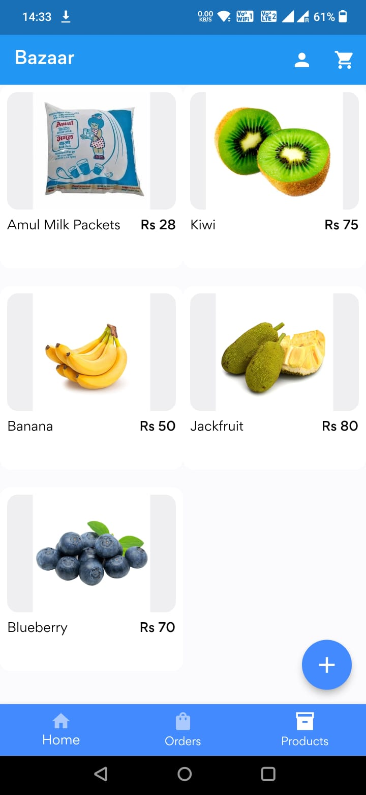

# Bazaar

Bazaar is a project developed to provide a common marketplace for the Farmers of India to seel & buy their goods without the involvement of the middlemen.

## Problem Statement

Develop a web and mobile application for a local farmer's market that allows customers to browse products, place orders, and schedule pickup or delivery.

## Description:

The web and mobile application should provide a user-friendly interface for customers to browse and purchase products from a local farmer's market. The application should allow customers to view product information, place orders, and choose pickup or delivery options. The system should be scalable and able to handle large amounts of user data and orders.

## Problem Inspiration:

Local farmer's markets are an important source of fresh and healthy food, but they often lack the convenience and accessibility of online shopping platforms. There is a need for a user-friendly application that allows customers to purchase local products and support local farmers.

## Screenshots

 |  |
  | 

 |  |
 |  | 

 | 

## Getting Started

This project is a starting point for a Flutter application.

A few resources to get you started if this is your first Flutter project:

- [Lab: Write your first Flutter app](https://docs.flutter.dev/get-started/codelab)
- [Cookbook: Useful Flutter samples](https://docs.flutter.dev/cookbook)

For help getting started with Flutter development, view the
[online documentation](https://docs.flutter.dev/), which offers tutorials,
samples, guidance on mobile development, and a full API reference.
